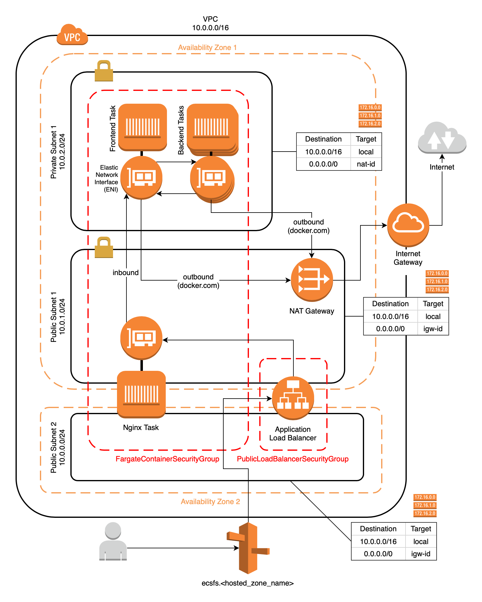

This is the code from the written guide:

- [Independently Scalable Multi-Container Microservices Architecture on AWS Fargate (I)](https://medium.com/@eulersson/microservices-on-fargate-part1-f26a318827a8)
- [Independently Scalable Multi-Container Microservices Architecture on AWS Fargate (II)](https://medium.com/@eulersson/microservices-on-fargate-part2-f29c6d4d708f)

## Diagram

